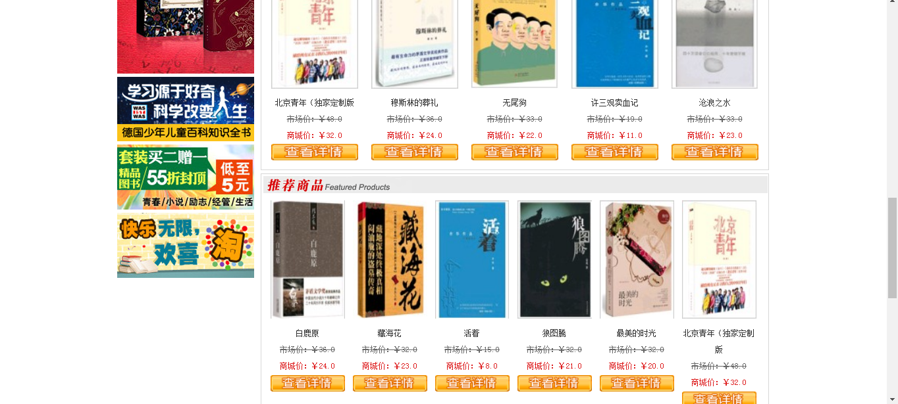

<h1 align="center">网上图书商城管理系统</h1>

## 简介
网上图书商城管理系统：角色分为管理员和用户；功能包括会员管理、图书分类与信息管理、订单与库存管理、促销活动发布、用户登录注册和商品推荐。    --计算机毕业设计源码；毕设源码；java毕业设计源码

## 联系方式

<h3 align="center">获取完整代码与数据库文件 + 微信：deepguan QQ: 86050149 QQ群: 783742310</h3>

<h3 align="center">可帮忙远程部署 包运行成功！提供远程部署、修改代码、设计文档指导、代码讲解等服务！</h3>

## 功能介绍（完整见运行截图）
管理员：提供后台管理功能，登录管理系统后可访问图书信息、用户管理、交易管理等模块。管理员可添加、删除、修改商品信息，处理订单，管理库存，发布新闻资讯。还可以查看用户信息，设置用户权限，更新系统公告。

用户：访问前台界面，通过输入用户名和密码登录商城，享受购物返点及推荐奖励等会员优惠。用户可以浏览图书分类，查看商品详情，加入购物车并结算订单，可在个人中心查看及修改个人信息、查询订单、管理地址和收藏夹。

## 运行截图

本代码来源于网络,仅供学习参考使用!

